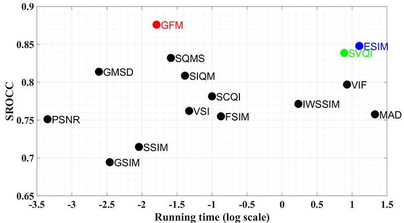

## A Gabor Feature-Based Quality Assessment Model for the Screen Content Images

#### IEEE Transactions on Image Processing (T-IP) 
[Zhangkai Ni](https://eezkni.github.io/), Huanqiang Zeng, [Lin Ma](http://forestlinma.com/), Junhui Hou, Jing Chen, and [Kai-Kuang Ma](https://scholar.google.com/citations?user=GGUNtCsAAAAJ&hl=en)

##### [Project](https://eezkni.github.io/publications/GFM.html) | [Paper](https://eezkni.github.io/publications/journal/GFM/GFM_ZKNI_TIP18.pdf) 

## Introdcurion

This website shares the codes of the "A Gabor Feature-Based Quality Assessment Model for the Screen Content Images", IEEE Transactions on Image Processing (T-IP), vol. 27, pp. 4516-4528, September 2018. 




### Abstract

In this paper, an accurate and efficient full-reference image quality assessment (IQA) model using the extracted Gabor features, called Gabor feature-based model (GFM), is proposed for conducting objective evaluation of screen content images (SCIs). It is well-known that the Gabor filters are highly consistent with the response of the human visual system (HVS), and the HVS is highly sensitive to the edge information. Based on these facts, the imaginary part of the Gabor filter that has odd symmetry and yields edge detection is exploited to the luminance of the reference and distorted SCI for extracting their Gabor features, respectively. The local similarities of the extracted Gabor features and two chrominance components, recorded in the LMN color space, are then measured independently. Finally, the Gabor feature pooling strategy is employed to combine these measurements and generate the final evaluation score. Experimental simulation results obtained from two large SCI databases have shown that the proposed GFM model not only yields a higher consistency with the human perception on the assessment of SCIs but also requires a lower computational complexity, compared with that of classical and state-of-the-art IQA models.

### Installation
```
git clone https://github.com/eezkni/GEM --recursive
cd GFM
```

### Gabor feature-based model for SCI Quality Assessment


### Experimental Results


## Citation

If this code/GFM is useful for your research, please cite our paper:

```
@article{ni2018gabor,
  title={A Gabor feature-based quality assessment model for the screen content images},
  author={Ni, Zhangkai and Zeng, Huanqiang and Ma, Lin and Hou, Junhui and Chen, Jing and Ma, Kai-Kuang},
  journal={IEEE Transactions on Image Processing},
  volume={27},
  number={9},
  pages={4516--4528},
  year={2018},
  publisher={IEEE}
}
```

## Contact

Thanks for your attention! If you have any suggestion or question, feel free to leave a message here or contact Mr. Zhangkai Ni (eezkni@gmail.com).


## License

[MIT License](https://opensource.org/licenses/MIT)